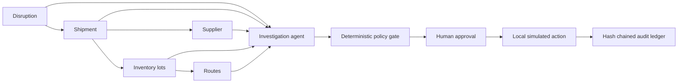

# Response Lab: Agentic Supply Chain Intelligence for Palantir Foundry

An evidence-first portfolio project for investigating supply chain disruptions. It links disruption, shipment, supplier, inventory, and route objects; proposes a response; checks cost and feasibility; requires a named human approval; and records a hash-chained audit trail. The complete demo runs locally on synthetic data. No Palantir account, API key, or paid service is needed.

> **Honest scope:** This is a Foundry-oriented architecture and local simulation, not a claim that it has been deployed to, or validated inside, a Palantir tenant. The supplied Foundry REST client is an integration scaffold and is never used by the local execution path.

## Run in two minutes

Python 3.10+ is the only requirement. From the repository root:

```bash
python -m pip install -e .
response-lab serve
```

Open **http://127.0.0.1:8765**. Click **Investigate** on a case, inspect the tool trace and citations, submit the eligible plan, enter an approver name, and execute the **local simulation**.

For a guided presentation, follow the [two-minute demo walkthrough](docs/WALKTHROUGH.md). It shows the approval and audit flow, two blocked cases, and exactly which parts run today.

The browser stores decisions in `.local/response_lab.db` under the directory where you start the command. For a fresh demo, choose a new file with `response-lab serve --db .local/fresh-demo.db`. The app binds to your computer only.

```bash
response-lab investigate DIS-001  # machine-readable plan, evidence, policy checks
response-lab evaluate              # three adversarial/decision scenarios
python -m unittest discover -s tests -v
```

The optional model-ranked path uses the [OpenAI Responses API structured output](https://developers.openai.com/api/docs/guides/structured-outputs?api-mode=responses):

```bash
export OPENAI_API_KEY=...
response-lab investigate DIS-001 --model
```

On Windows PowerShell, set the key for the current shell with `$env:OPENAI_API_KEY="..."`. Do not commit it. The standard demo and evaluation run without any API key.

The model only ranks server-calculated, feasible inventory/route pairs. Its selection must match an allowlisted pair; all quantities, timing, cost, evidence, and policy checks are computed again by code. Offline mode chooses the fastest policy-compliant route, breaking ties by cost. If every feasible route fails policy, it returns a blocked recommendation for inspection.

## Why this problem

Real operational response requires linked context, accountable decisions, and safe writes. This project demonstrates the intersection of agentic AI, an ontology-centered Foundry design, and DevOps controls: typed read tools, deterministic validation, approval, audit integrity, local-first testing, and CI.



## Scenario coverage

| Case | Operational question | Expected outcome |
| --- | --- | --- |
| DIS-001 | Can 120 sensors be rerouted? | Dallas lot and Chicago route save 9 days at $5,160, then await human approval. |
| DIS-002 | Can 90 pumps be replaced? | No: the alternate lot has only 25 units. |
| DIS-003 | Is the fast chip route acceptable? | No: its $15,250 cost exceeds the $10,000 policy. |

## Safety and engineering details

- Six explicit, read-only tools; no model-facing write tool.
- Source fields are captured as `ontology://` evidence references in every proposal.
- The browser cannot alter quantities, savings, costs, or citations: submission rebuilds and compares the proposal against ontology records.
- Named approval, repeat-safe execution, one execution per shipment, inventory conflict detection across processes, and local-only server binding.
- SQLite audit records are chained with SHA-256; tampering is detectable with `audit_valid()`.
- Synthetic data contains no resume content or real operational data.

See [Foundry integration blueprint](docs/FOUNDRY_BLUEPRINT.md) for ontology mappings, AIP Logic, permissions, and deployment steps. See [security and limitations](docs/SECURITY.md) before adapting the code for production.

## Repository map

```text
src/response_lab/assets/data/  Synthetic ontology objects and policy
src/response_lab/assets/web/   Dashboard included in the package
src/response_lab/engine.py     Investigation, policy, approval, audit
src/response_lab/model.py      Optional structured model ranking
src/response_lab/foundry.py    Foundry REST boundary (inactive in demo)
src/response_lab/server.py     Local dashboard API
tests/                         Scenario and governance checks
docs/                          Integration and security notes
```

## License

MIT. This is an independent portfolio project and is not affiliated with Palantir.
